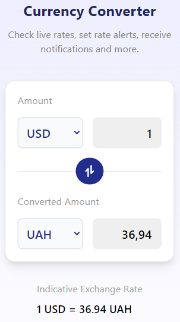

# Currency converter

This project was bootstrapped with [Create React App](https://github.com/facebook/create-react-app).

## Description

The application is a simple currency exchanger. You can choose different currencies, change the values in two fields. The rate of the selected currencies is displayed at the bottom

## How to start

1. Download the project as an archive or using the git copy command git@github com:ArtemRozzhivin/currency-converter.git

2. Register at https://currencyapi.com/

3. Create your own API key

4. Rename the ".env.example" project file to ".env" and paste your API key into the appropriate field

5. Run the "npm i" command

6. Run the application with the "npm run start" command

7. Ready 😉

## Available Scripts

In the project directory, you can run:

### `npm start`

Runs the app in the development mode.\
Open [http://localhost:3000](http://localhost:3000) to view it in your browser.

The page will reload when you make changes.\
You may also see any lint errors in the console.

### `npm test`

Launches the test runner in the interactive watch mode.\
See the section about [running tests](https://facebook.github.io/create-react-app/docs/running-tests) for more information.

### `npm run build`

Builds the app for production to the `build` folder.\
It correctly bundles React in production mode and optimizes the build for the best performance.

The build is minified and the filenames include the hashes.\
Your app is ready to be deployed!

See the section about [deployment](https://facebook.github.io/create-react-app/docs/deployment) for more information.

### `npm run eject`
